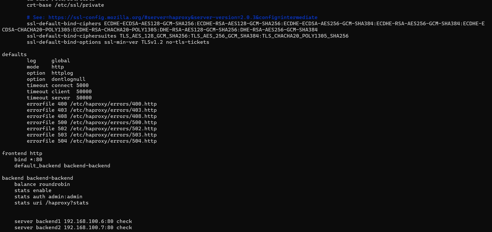
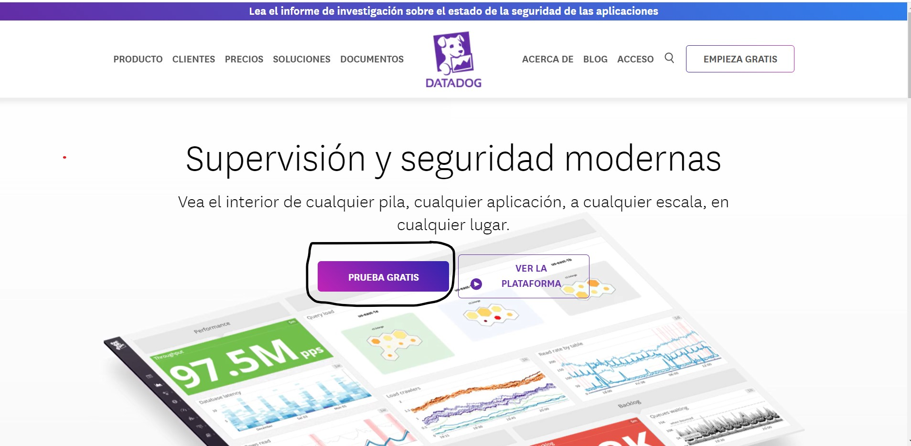

# Balanceador de carga con haproxy

## Descripción.
En este proyecto se muestra cómo configurar un balanceador de cargas con HAProxy y tres máquinas de Ubuntu.

## Requisitos previos
Antes de comenzar con la configuración del balanceador de cargas, se deben cumplir los siguientes requisitos:

1. Tener tres máquinas virtuales de Ubuntu instaladas y configuradas en la misma red.
2. Tener privilegios de superusuario en las tres máquinas.
3. Tener instalado HAProxy en la máquina que actuará como balanceador de cargas.

# Configuración.
## Configuración de las máquinas virtuales.
1. Configuración de la primera máquina virtual

* Nombre de la maquina: haproxy
* IP: 192.168.100.5
* Sistema operativo: Ubuntu
* Servidor  instalado: se instala con el comando apt install haproxy y datadog-agent

2. Configuración de la segunda máquina virtual

* Nombre de la maquina: backend1
* IP: 192.168.100.6
* Sistema operativo: Ubuntu
* Servidor web instalado: Apache
* Se debe crear un archivo index.html el cual se crea en la ruta var/www/html

3. Configuración de la tercera máquina virtual

* Nombre de la maquina: backend2
* IP: 192.168.100.7
* Sistema operativo: Ubuntu
* Servidor web instalado: Apache
* Se debe crear un archivo index.html el cual se crea en la ruta var/www/html

# Configuración del balanceador de cargas

1. Instalar HAProxy en la máquina que actuará como balanceador de cargas en este caso es la maquina con el nombre de haproxy.
2. Crear un archivo de configuración para HAProxy en /etc/haproxy/haproxy.cfg.
3. Configurar el archivo de configuración de HAProxy de la siguiente manera:

4. Reiniciar HAProxy para aplicar los cambios.

# Uso
Para usar el balanceador de cargas con HAProxy y tres máquinas de Ubuntu, sigue los siguientes pasos:

1. Accede al balanceador de cargas a través de su dirección IP en ete caso es la maquina con el nombre de haproxy.
2. La solicitud será dirigida a uno de los dos servidores web de manera aleatoria.

# Configuración de Datadog

1. Crear la cuenta en datadog dando click en prueba gratuita.

2. luega llenas tus datos personales.
3. Te pidiran que instales el agente de datadog asi:

# Contacto
Si tienes preguntas o sugerencias sobre este proyecto, por favor contáctame en mi correo electrónico: [jhon.lenn@uao.edu.co].

